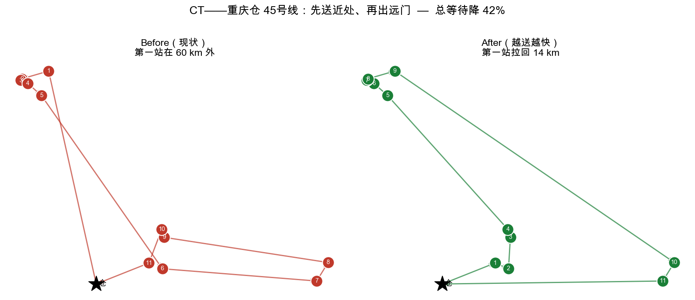
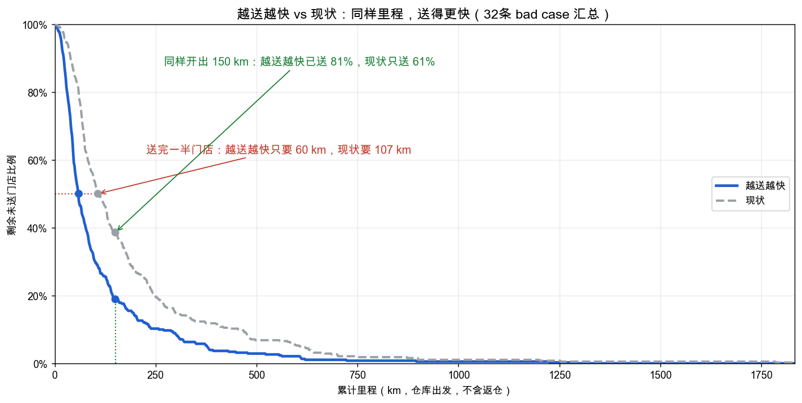

# 越送越快 — 排线送达顺序优化

# 1. 背景

**问题**：沈阳仓一线反馈，现在的排线经常**把很远的门店排成第一站**——车刚在仓库装满货，就直奔几十甚至上百公里外，送完再折返回近处一家家送。相当于"满载跑长途"，近处的店反而等最久。

**为什么值得改（收益）**：
- **安全**：车重、路远——满载跑长途本身就不安全。
- **省油钱**：先把近处的货卸掉、车越送越轻，重载行驶的距离变少，油耗随之降低。
- **效率**：① 先在近处卸掉一批货，后半程车空，装卸更顺；② 避免"先跑远、回来时近处门店已经关门"，耽误当天配送。

**真实案例**（pt = 2026-05-26，全国一天数据）：
- **重庆仓 45 号线**：第一站原本在 **60km** 外（车刚满载就直奔最远处），重排后第一站拉回 **14km**——先把仓库附近送完再出远门；全线"总等待"下降 **42%**。
- **沈阳仓 44 号线**：第一站 27.8km → 16.8km，总等待下降 30%，总里程还略降。

> 左（现状）：车从仓（★）一箭直奔 60km 外的远簇送第一站；右（越送越快）：先把仓边近店送完，再逐步往远处走。

# 2. 算法

**目标：让所有门店"平均等得最短"**（= 送得快）。

先看一个小例子。一条线：仓库 → A → B → C，三段路分别 2km、3km、4km：

| 门店 | 送到它时车已经开了多少公里（= 它等了多久）|
|---|---|
| A | 2（仓→A）|
| B | 2 + 3 = 5 |
| C | 2 + 3 + 4 = 9 |
| **合计（＝「带里程的总等待」）** | **2 + 5 + 9 = 16** |

**这个数就是我们优化的目标——「带里程的总等待」，越小越好**（每家店的"等待"用"送到它时车开了多少 km"来衡量，再把所有店加总；下文简称"总等待"）。它本质上是**给每一段路按"还有几家店在等"加权**——越小代表大家平均越早收到货、越"送得快"。我们做的事就一句话：**门店不变，只调换送达顺序，让它最小**——算出来自然就是"近的先送、远的留后"。

**用这个指标算一次前后对比。** 一条线有仓库、一个近店（离仓 5km）、一个远店（离仓 50km），两店相距 48km。同样这两个点、两种送法：

| 送达顺序 | 近店送到时已开 | 远店送到时已开 | 总里程 | 总等待 |
|---|---|---|---|---|
| 先送远（现状常见） | 98 km | 50 km | 103 km | 50 + 98 = **148** |
| **先送近（越送越快）** | 5 km | 53 km | 103 km | 5 + 53 = **58** |

**两条安全护栏**（防止为了送得快乱绕路）：
1. **里程不许明显变长**：重排后全线里程最多只允许上升 1%（或 5 公里）。绝大多数线反而更短，基本不多费油。
2. **只动"明显该改"的线**：只有"总等待能降 ≥ 30%、且线路本身够长（含回仓 > 70km）"的线才建议改；小短线省一点也不折腾。

> 说明：本期只做"送得快"这一条，**没有掺入"重货先卸"**（那是另一层优化，见下一步）。距离暂用直线近似（原因见下一步）。
>
> 术语（专业）：这在运筹学里是**最小延迟问题（Minimum Latency Problem，又称旅行修理工问题 TRP）**——旅行商问题（**TSP**）的变种：TSP 求"总里程最短"，我们求"带里程的总等待最小"。求解方法是**邻域搜索**（2-opt 段反转 + relocate 挪点，局部迭代到无改进）。

# 3. 结果

pt = 2026-05-26 全国一天：覆盖 **40 个仓 / 255 条线路**（长春、乌鲁木齐、拉萨、北京等外包/特殊仓不参与），命中"明显该改"的 bad case **32 条**。

**这批线：里程没有增加，但送得更快。** 下图横轴 = 从仓库开出的累计里程，纵轴 = 还没送到的门店比例。实线（越送越快）始终压在虚线（现状）下方，读两个点就懂：
- **送完一半门店**：越送越快只要 **60km**，现状要 **107km**（横线）。
- **同样开出 150km**：越送越快已送 **81%**，现状才 **61%**（竖线）。

两种排法**总行驶里程基本一致、没有增加**。

**交互式对比图**（下拉切仓、左 Before / 右 After、红边高亮该改的线、数字 = 送达顺序）：
示例中使用过 `tonkm_viz_20260526.html`，该交互文件未随 skill 附带。

# 4. 下一步

- [ ] **高德导航距离验证**：用高德真实驾车距离复核这批重排，确认实际行驶里程**没有增加**。
- [ ] **送重货（重货先卸）**：门店较多的线路，可在"送得快"之上叠加"重的先送"，进一步提升装卸效率；本期未纳入。
- [ ] **参数松紧权衡**：门槛卡紧 → 命中少但更准；放松 → 命中多但准确率下降。按灰度反馈校准阈值。
- [ ] **准备灰度 10 个仓**：先小范围上线验证效果，再逐步铺开。
